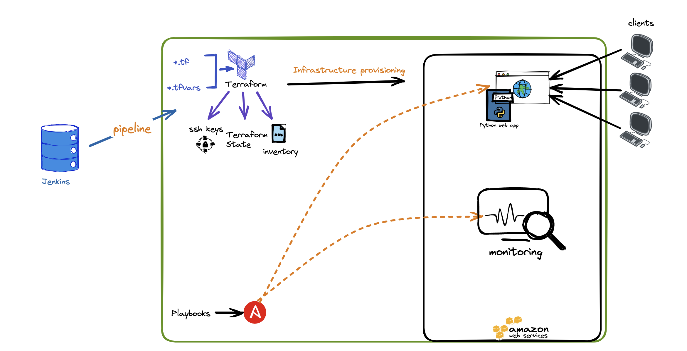

# Greenroad
Home assignment for creating a containerized web site with Python + Monitoring system for @Greenroad

- [Project purpose and architecture](#architecture)
- [Technologies used](#actions)
- [Deployment ](#projects)
- [The tests ](#tests)
- [How to use](#scopes)
- [Future](#scopes)

# Project purpose
Senior DevOps Engineer Home Challenge for @Greenroad
As part of this Home assignment, I was required to create a web-app, test and create useful CI flow along with monitoring system for the containerized enviornment and for the web-page

important notes:
1. Engineers cannot deploy to same enviorment  
This was done by using GIT to manage my Terraform code. It allows me to track changes to your code and manage conflicts one build at a time.
2. Links can be seen throughout the Jenkins jobs run  
2.1 deployed web app 
2.2 docker image 
3. Emails on failed test 

# Architecture

 
Greenroad web app CICD flow involves the following stages:   

1. `Deploy`  
This step deploys an EC2 instance to aws, using terraform aws module 
2. `verify hosts are reachable	` 
This step verifies that the EC2 instance was created succesfully 
3. `Install`  
This step installs our web application on top of the EC2 using ansible whcih runs docker-compose to initiate a docker container that holds our web app  
4. `Test`  
This step tests the functionality of the web-app  
5. `Release`  
This step releases the image as artifact to dockerhub.  
This image containes the latest of our code

# Deployment
To deploy development enviornemt:
1. Login to jenkins in http://xxxxxxxx:8080/job/deploy-ci/
2. Go to deploy-ci job
3. Press on your development branch
4. Build with Parameters
5. set Region and 'build'

## Deploy locally (installing web-app only)
    pre-requisites:
        docker | docker-compose | python | virtualenv | pip | git

    git clone clone https://github.com/KobeVK/containerized-web-site
    cd containerized-web-site && docker-compose.yml up -d

# The tests
1. a simple health check tests that returnes  200 OK if the site is up

# Artifacts
The product is the web-app containerized and pushed to docker hub.
auto versioned by the Jenkins job number  
 https://hub.docker.com/r/sapkobisap/greenroad:tag

# Future work
1. Migrate to a microservice architecure
2. Write pytests

